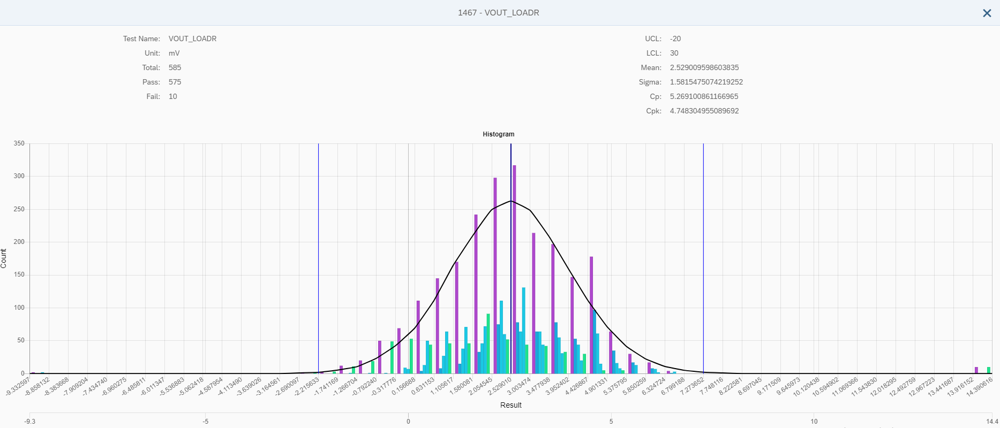

常态分布与直方图的应用
===

## 基础观念

### 直方图

直方图与柱状图都是以「柱」的方式呈图，两者间的主要差异是：柱状图中各柱间没有显著关联，例如人口统计时的城市；直方图的各柱间有连续的关系，例如考试分数以 10 分数为间距进行统计。

### 常态分布图

常态分布图 __不是__ 呈线实际数据的分布，而是利用数据的 mean、sigma，配合 ztable 查表，建立资料的理论分布状况。因为是常态分布，曲线呈现钟形并左右对称，3 sigma 间的数据接近全体数据总数的 84%。 

## 应用
当两者要堆叠呈图时，首要确认间距的大小，那是以直方图为准还是常态分布图？

若以直方图为基准，根据样本最大与最小值切成 20 等份进行分布统计，这时常态曲线图的 mean 和 3 sigma 值，将不可能准确落在直方图的刻度上，若直方图的间距与 sigma 的差距过大或过小，会直接影响到钟形曲线的波峰位置。

所以，先计算出数据的 mean 和 sigma 值，再将 3 sigma 间切成 20 等份，作为柱状图的间距，如此 mean 和 3 sigma 值必定会落在刻度上，钟形曲线的波峰也会贴近直方图上的统计值。

等间距是必要的，间距不同会影响到钟形曲线的呈图，甚至变形。

## 案例

