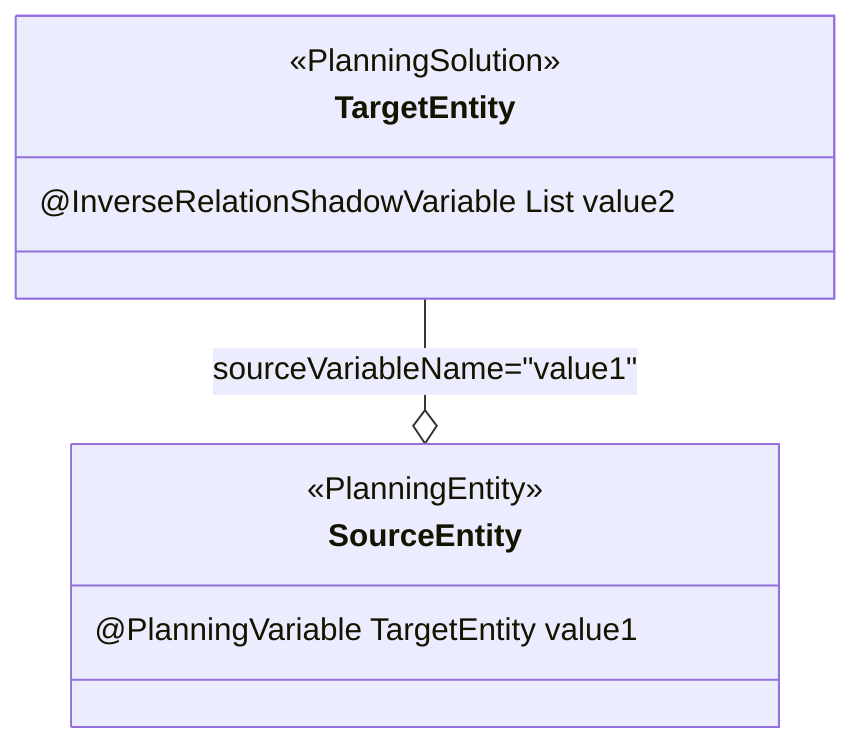
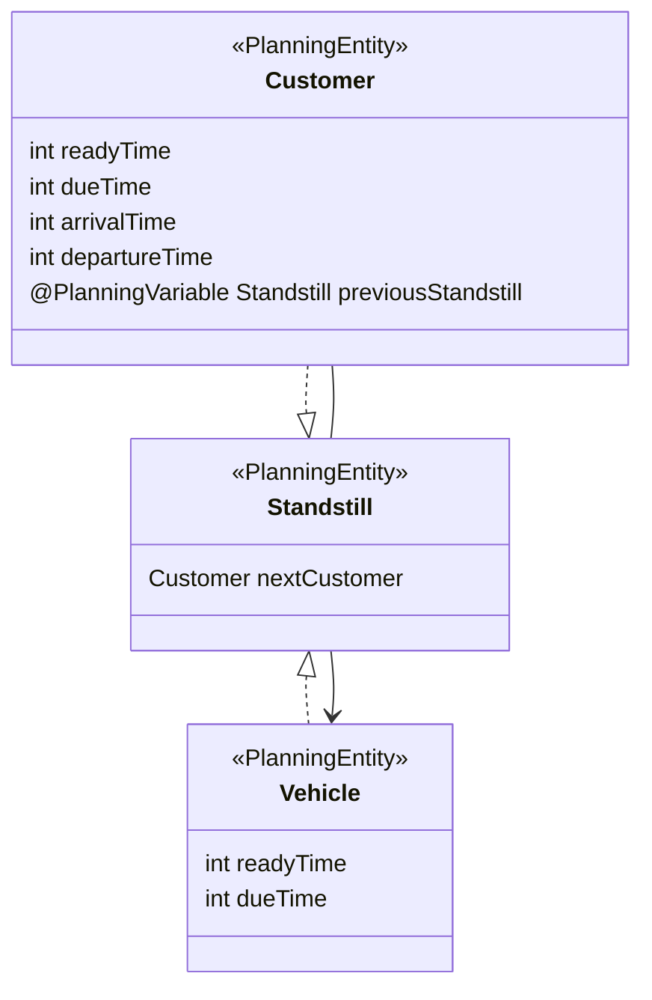

OptaPlanner Study
===

## 名词

* ProblemSolution - 方案核心，提供解决问题所需的信息。

* ProblemFact - 不随问题解决过程变化的因子。

* PlanningEntity - 随问题解决过程不停变化的单体。

## 变数 Genuine Planning Variable

1. MySolution - 方案核心，提供一组 MyValue 答案供 MyEntity 选择。

2. MyEntity - 待解单体。

3. MyEntity.answer - 解答，为 MySolution.valueList 其中之一。 

## 变数 Shadow Variable
Shadow Variable 的特性是根据 Genuine Planning Variable 的状态动态决定。以收快递为案例，__抵达本地的时间__ (Shadow Variable)，可以根据 __离开上一站的时间__ (Genuine Planning Variable) 计算出来。

Shadow Variable 的应用方式有几种：

### Bi-Direction Variable 双向多对一参考变数

1. SourceEntity 的 value1 是 Genuine Planning Variable，型别为 `TargetEntity`。

2. TargetEntity 的 value2 是 Shadow Variable，型别为 `List<SourceEntity>`，利用 `@InverseRelationShadowVariable(sourceVariableName="value1")` 标示追踪 SourceEntity 的 value1。

3. 当 value1 改变时调整对应 TargetEntity 内 value2 的集合内容。

### Bi-Direction Variable 双向一对一参考变数，又称 Chained Planning Variable

1. SourceEntity 的 value1 是 Genuine Planning Variable，型别为 `TargetEntity`，标示 `@PlanningVariable(graphType = PlanningVariableGraphType.CHAINED, ...)`

2. TargetEntity 的 value2 是 Shadow Variable，型别为 `SourceEntity`，利用 `@InverseRelationShadowVariable(sourceVariableName="value1")` 标示追踪 SourceEntity 的 value1。

3. 当 value1 改变时，调整对应 TargetEntity 内 value2 的参考。

在此模式下，增加一种新的变量，称为 Anchor shadow variable。

以 TSV 案例为例：

